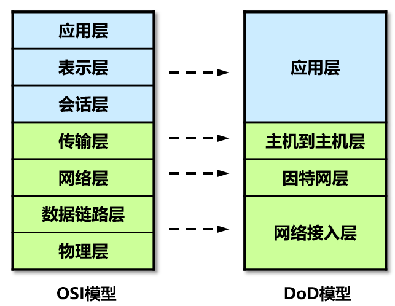

本节详细协议细节参考《计算机网络》内容

# OSI网际互联简介 #

**概念：**OSI是Open System  Interconnection的缩写，意为开放式系统互联模型，是由ISO（国际标准化组织）定义的。它是个零花的、稳健的和可互操作的模型，并不是协议，是用来了解和设计网络体系结构的。

**目的：**规范不同系统的互联标准，使两个不同的系统能够较容易的通信，而不需要改变底层的硬件或软件的逻辑。

**模型：**OSI把网络按照层次分为七层，由下到上分别为物理层、数据链路层、网络层、传输层、会话层、表示层、和应用层。

**优点**：

- 将网络的通信过程划分为小一些、简单一些的部件,因此有助于各个部件的开发、设计和故障排除
- 通过网络组件的标准化,允许多个供应商进行开发
- 通过定义在模型的每一层实现什么功能,鼓励产业的标准化
- 允许各种类型的网络硬件和软件相互通信
- 防止对某一层所做的改动影响到其他的层,这样就有利于开发

## OSI模型模型体系结构 ##

# TCP/IP协议 #

TCP/IP（Transmission Control Protocol/Internet Protocol）是传输控制协议和网络协议的简称，它定义了电子设备如何连入因特网，以及数据如何在它们之间传输的标准。

TCP/IP 不是一个协议，而是一个协议族的统称，里面包括了 IP 协议、ICMP 协议、TCP 协议、以及 http、ftp、pop3、https 协议等。网络中的计算机都采用这套协议族进行互联。

**应用层：**

- HTTP 80：超文本传输协议，提供浏览网页服务
- Telnet 23：远程登陆协议，提供远程管理服务
- FTP 20、21：文件传输协议，提供互联网文件资源共享服务
- SMTP 25：简单邮件传输协议，提供互联网电子邮件服务
- POP3 110：邮局协议，提供互联网电子邮件服务
- TFTP   69 (UDP)：简单文件传输协议，提供简单的文件传输服务

**主机到主机层：**

TCP，UDP

**因特网层：**

ARP（Address Resolution Protocol）地址解析协议：将IPv4地址解析为MAC地址维护映射的缓存。