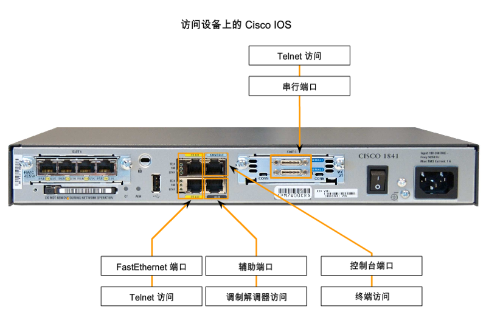
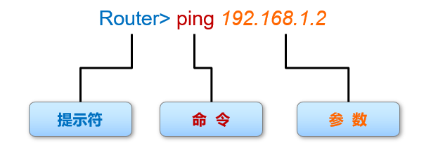
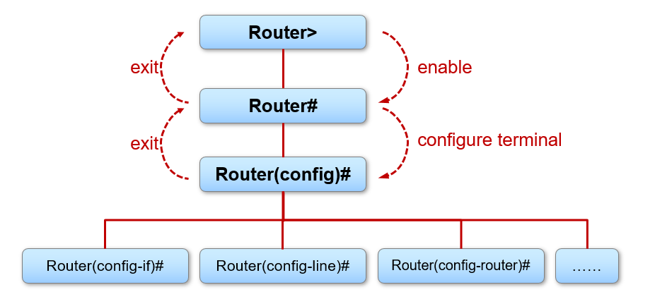

[TOC]

# Cicso IOS简介

Cisco Internetwork Operating System（IOS）是为 Cisco 设备配备的系统软件。它是 Cisco 的一项核心技术，应用于路由器、局域网交换机、小型无线接入点、具有几十个接口的大型路由器以及许多其它设备。

Cisco IOS可为设备提供下列网络服务：

- 基本的路由和交换功能
- 安全可靠地访问网络资源
- 网络可伸缩性

路由器1841型号如下图所示




考虑到实际硬件设备昂贵，我们使用[Cisco Packet Tracer](https://www.netacad.com/zh-hans/courses/packet-tracer)模拟网络环境。

## IOS模式

进入Cisco IOS的命令行界面，可以通过命令操纵设备，基本命令格式如下：



- 每个IOS命令都具有特定的格式或语法，并在相应的体术符下执行
- 常规命令语法位命令后接相应的关键字和参数

其中，提示符显示了当前的模式，Cisco IOS的主要模式有用户执行模式（>）、特权执行模式(#)、全局配置模式和其他特定配置模式。全局配置模式可进行多种不同的配置模式。其中的每种模式可以用于配置IOS设备的特定部分或特定功能，比如接口模式用于配置网络接口、线路模式配置线路、路由配置模式配置路由协议选择协议进程的相关参数。



若忘记命令参数，可以在命令后输入`?`显示提示。

# 常用命令

## 控制台口令

用于限制人员通过控制台访问设备。

配置设备名称：

```
Router(config)#hostname AnakinJiang
AnakinJiang(config)#
```

进入控制线配置模式

```
R1(config)#line console 0
```

将用户口令设置位cs

```
R1(config-line)#password  cs
```

启用登陆时的口令检查

```
R1(config-line)#login
```

## 使能口令

用于限制人员访问执行模式

```
Router(config)#enable password spoto
```

## VTY口令

用于限制人员通过Telnet访问设备

进入VTY线配置模式，并且VTY线的范围0-4

```
Router(config)#line vty 0 4
```

将用户口令设置为cs

```
Router(config-line)#password  cs
```

启用VTY会话登陆时的口令检查

```
Router(config-line)#login
```

## 管理配置文件

将当前配置写入启动配置文件

```
R1# write
R1# copy running-config startup-config
```

删除启动配置文件

```
R1# erase startup-config
R1# delete flash:config.text
```

## 接口配置

进入接口

```
R1(config)# interface ethernet 0/0
R1(config-if)#
```

为接口配置IP地址

```
R1(config-if)# ip address 192.168.1.1 255.255.255.0
```

激活接口

```
R1(config-if)# no shutdown		//CISCO设备接口默认shutdown状态
```

配置serial接口

```
R1(config)# interface  serial 0/0/0
R1(config-if)# ip address 192.168.1.1 255.255.255.0
R1(config-if)# no shutdown
R1(config-if)# clock rate 64000	// 在DCE端配置时钟信号
```

配置telnet密码

```
R1(config)# line vty 0 4
R1(config-line)# password spoto
R1(config-line)# login
```

show命令查看基本信息

```
show version		查看当前操作系统版本
show running-config		查看运行配置
show startup-config		查看启动配置

show flash		查看FLASH
show cpu			查看CPU利用率
show memory		查看内存使用情况
show interface 		查看端口
```

## 路由相关

查看路由表

```
R1# show ip route
```

