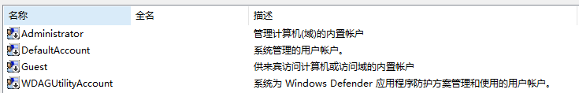

[TOC]

以下案例均以windows10为例

# 账户管理

查看Windows账户方法：在“运行”中输入“lusrmgr.msc”（local user manager）

## Windows内置用户

**Administrator：**Administrator 账户具有对服务器的完全控制权限，并可以根据需要向用户指派用户权利和访问控制权限。Administrator 账户是服务器上 Administrators 组的成员。永远也不可以从 Administrators 组删除 Administrator 账户，但可以重命名或禁用该账户。 

**Guest：**默认情况下，Guest 账户是默认的 Guest 组的成员，该组允许用户登录服务器。其他权利及任何权限都必须由 Administrators 组的成员授予 Guests 组。默认情况下Guest 账户是禁用。 

## Windows默认用户组

**Aministrators：**管理员对计算机/域有不受限制的完全访问权 

**Power User：**高级用户(Power Users)拥有大部分管理权限，但也有限制。因此，高级用户(Power Users)可以运行经过验证的应用程序，也可以运行旧版应用程序 

**Users：**用户无法进行有意或无意的改动。因此，用户可以运行经过验证的应用程序，但不可以运行大多数旧版应用程序 

**Guests：**按默认值，来宾跟用户组的成员有同等访问权，但来宾帐户的限制更多 

## 权限关系

System>Administrators>Power Users>Users>Guests

## 命令方式

管理用户

- net user：显示所有的用户
- net user Anakin：显示Anankin账户的信息
- net user Anakin 123 /add：新建用户名为Anakin密码为123的账户
- net user Anakin /time:M-F,8am-5pm：设置Anakin账户登录时间（周一至周五早上8点到下午5点） 
- net user Anakin /active:yes ：启用Anakin账户
- net user Anakin /active:no ：禁用Anakin账户
- net user Anakin /del：删除Anakin账户

管理组

- net localgroup ：显示本地服务器上所有的组 
- net localgroup tests /add ：新建tests组
- net localgroup tests Anakin/add：将Anakin账户加入tests组
- net localgroup tests Anakin/del：将Anakin账户从tests组中删除
- net localgroup tests /del ：删除tests组

# 身份认证

身份认证也称为“身份验证”或“身份鉴别”，是指在计算机及计算机网络系统中确认操作者身份的过程，从而确定该用户是否具有对某种资源的访问和使用权限，进而使计算机和网络系统的访问策略能够可靠、有效地执行，防止攻击者假冒合法用户获得资源的访问权限，保证系统和数据的安全，以及授权访问者的合法利益。 

## 交互式登录过程

## 网络身份验证过程

NTLM认证

Kerberos V5认证

# 访问控制

访问控制是允许用户和计算机访问系统或网络对象的过程，构成访问控制的主要概念是权限、用户权利和对象审查。访问控制的主要功能是防止非法的主体进入受保护的网络资源，允许合法用户访问受保护的网络资源，防止合法的用户对受保护的网络资源进行非授权的访问。 

## 访问控制的类型

**自主访问控制：**资源的所有者有权对自己的资源进行访问控制，可授权或收回其他人对这些资源的访问 。

**强制式访问控制：**由系统（通过专门设置的系统安全员）对所有的访问对象进行统一的强制性访问控制，按照既定的规则决定哪些用户可以对哪些对象进行什么样操作类型的访问。

# 数据安全

加密指对文件或数据按照某种算法进行处理，使其成为不可读的一段代码。处理前的文件或数据，称之为“明文”。处理后的代码，通常称为“密文”。使用相应的密钥对加密后的文件进行还原的过程为“解密”。

**加密的理由：**网络协议先天不足导致的网络传输被监听、篡改。保存在本地的机密信息的泄露、丢失。

## 加密算法对称算法

又称常规加密或者单密钥加密，算法公开，改变密钥就改变输出。

- 优点：运算速度快安全性高
- 缺点:密钥分发困难，每对通信者间都需要不同的密钥N个人需要维护N(N-1)/2个密钥。

如DES、3DES、AES等

## 非对称加密算法

- 加密密钥和解密密钥不同。

- 解密密钥不能由加密密钥计算出来。

- 加密密钥能够公开，陌生人可以使用加密密钥进行加密，但只有解密密钥才能解密。

- 基于复杂的数学难题

如RSA等 

## 摘要算法

- 即散列算法或称哈希算法
- 不需要密钥
- 单向加密
- 输出长度固定
- 给出函数就很容易计算出摘要
- 不同数据的摘要不同

如MD5。

# 安全策略

安全策略是影响计算机上安全性的安全设置的组合。

- 公钥策略：管理员可自动为计算机颁发证书、管理加密的数据恢复代理、创建证书信任列表，或自动建立颁发机构的信任。 
- IPSec策略：管理网际协议，保护数据安全和减少来自网络的攻击 
- 软件限制策略：允许哪些软件运行，可以有效防止病毒的蔓延
- 本地策略：可以对事件审核（如：登录事件）、指派用户权利、控制网络访问 
- 账户策略：可以设置账户密码长度、锁定策略，防止穷举法破解帐户密码。 

# 系统安全加固

## TCP/IP筛选对端口进行保护

## 防止对服务器的ARP攻击